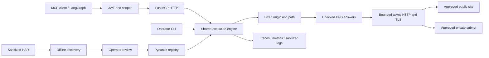

# FastMCP Gateway

### Turn approved website endpoints into a governed interface for AI agents.

**Python · FastMCP · asyncio · Pydantic · OpenTelemetry · LangGraph · AWS**

Expose public and private-network websites through **three MCP tools and a matching CLI**. An operator reviews a small registry; the gateway enforces destination policy, caller scopes and bounded responses on every execution.

Start with a website you are authorized to access—even one without a documented public API. Import a sanitized browser HAR file, review the discovered GET endpoints, and publish only the operations that agents need.

> A runnable reference implementation with production-oriented controls, tests and deployment examples. Enterprise deployment requires your identity provider, network policy, data-owner approval and environment-specific validation. Universal website automation without configuration is not claimed.

## Quick start

Install [uv](https://docs.astral.sh/uv/getting-started/installation/), then:

```bash
uv sync --frozen --python 3.12
uv run fastmcp-gateway init
uv run fastmcp-gateway demo
```

No LLM key, cloud account or external website is needed. `init` generates a unique development bearer token in the ignored `.env` file and a demo registry. Existing files are never overwritten. The server binds to `127.0.0.1:8000`; `/healthz` reports process health and `/mcp` requires authentication.

In another terminal, run a real MCP client:

```bash
uv run python examples/mcp_client.py
```

It discovers the catalog, inspects its operations, and retrieves:

```json
{
  "site": "catalog",
  "operation": "search",
  "data": [{"id": "HW-001", "name": "ThinkPad T14", "price": 1299, "currency": "EUR", "stock": 12}],
  "truncated": false,
  "untrusted": true,
  "request_id": "<generated-per-execution>"
}
```

All demo products and policies are fictional. Stop the server with Ctrl+C.

### The same workflow through CLI

```bash
uv run fastmcp-gateway sites
uv run fastmcp-gateway operations catalog
uv run fastmcp-gateway call catalog search --params '{"q":"ThinkPad"}'
uv run fastmcp-gateway call catalog handbook
```

The CLI is an **operator interface**: OS access to local configuration, network and secrets grants access to configured sites. Remote users must use authenticated MCP. CLI results are JSON on stdout; errors are bounded JSON codes on stderr with a nonzero exit status.

### Docker

After `init`, stop the Python server to release port 8000:

```bash
docker compose up --build
```

Compose runs the demo with a read-only filesystem, non-root UID 10001, no Linux capabilities, `no-new-privileges`, resource limits and a loopback-only published port. The production image defaults to `serve`; demo data is enabled only by `demo` in development mode.

## Architecture

The public MCP catalog stays at three tools as the registry grows:

1. **`list_sites()`** — reveal only connectors authorized for the caller.
2. **`list_operations(site)`** — discover operation contracts when needed.
3. **`execute(site, operation, params)`** — fetch through one audited policy boundary.

FastMCP also exposes a policy resource and an evidence-oriented research prompt. The small tool surface is a structural property, not a claimed token-efficiency benchmark.



See [architecture decisions](docs/architecture.md), [threat model](docs/security.md), [operations](docs/operations.md) and [validation evidence](docs/validation.md).

## Onboard a website

### 1. Discover endpoints offline

Use browser developer tools to capture relevant Network requests and export a **sanitized HAR**. HAR files may retain personal data even after browser sanitization; keep real captures local.

```bash
uv run fastmcp-gateway import-har examples/sanitized.har --origin https://inventory.corp.example --name inventory > config/candidate.json
```

The importer makes **no network requests**. It selects same-origin GET requests returning JSON, HTML or plain text; deduplicates paths; drops headers, cookies, bodies and query values; and excludes obvious sensitive query names. Cross-origin analytics and non-GET requests are excluded.

The candidate has `approved: false`, which the runtime refuses. Paths and query names can themselves contain sensitive identifiers: review them too. Discovery is an inventory, not proof of endpoint safety.

### 2. Review a narrow contract

Copy [the enterprise example](config/enterprise.example.toml) to `config/local.toml`, or review the generated JSON. Specify exact origins, fixed paths, allowed query keys and output fields. Confirm every GET is genuinely read-only before approving.

```toml
development = false

[[sites]]
name = "inventory"
base_url = "https://inventory.corp.example"
approved = true
allowed_networks = ["10.42.16.0/24"]
credential_env = "INVENTORY_AUTHORIZATION"
credential_header = "Authorization"
# ca_bundle = "/run/secrets/corporate-ca.pem"

[[sites.operations]]
name = "search"
path = "/api/assets"
description = "Search the approved inventory dataset."
query_params = ["q", "page"]
fields = ["id", "name", "status"]
max_items = 50
```

```bash
uv run fastmcp-gateway validate --config config/local.toml
```

Validation rejects unknown keys, duplicate names, ambiguous paths, URL credentials and non-HTTPS production upstreams. It checks configuration, not connectivity. Clients cannot supply arbitrary URLs, methods, paths or headers.

JSON projection selects **top-level** keys in an object or each element of a top-level array. Review nested objects for sensitive data. `fields = []` returns bounded JSON without projection. Custom pagination, dynamic path IDs, nested filtering and domain transformations need a reviewed adapter.

### 3. Run inside the network

Deploy on a host/container/VPC connected to the intranet, VPN and corporate DNS. The gateway cannot create that connectivity. Private destinations require explicit per-site CIDRs; loopback is development-only. Link-local, cloud metadata, multicast, unspecified and IPv4-mapped IPv6 addresses remain blocked.

The connection resolver validates the actual DNS answer set and passes those addresses directly to aiohttp. Redirects are refused. TLS verifies the original hostname; mount a corporate CA bundle rather than disabling verification. Environment HTTP proxies are ignored: use routed access or a separately reviewed egress-proxy adapter.

### 4. Connect identity and secrets

Use [.env.example](.env.example) as the production reference. Remove the local development token when switching modes. Production rejects static tokens and development registries. Configure HTTPS JWKS, issuer, audience and explicit hostnames. JWTs must be RS256-signed, have an unexpired `exp`, a nonempty string `sub`, and valid optional `nbf`/`iat` claims.

Grant scopes such as `site:inventory:read`. Caller tokens are **never forwarded upstream**. Upstream credentials come from a per-site environment variable; supported operator-selected headers are `Authorization`, `X-API-Key` and `Cookie`. Supply the entire header value, including `Bearer ` when required. Use a dedicated read-only service identity.

This is a resource server for pre-issued bearer tokens. Interactive OAuth discovery/login, per-user downstream impersonation and tenant isolation are not implemented. Use a client supporting bearer authentication or integrate an organization-approved OAuth provider.

## Agent and AWS examples

```bash
uv sync --frozen --extra agent
uv run python examples/langgraph_agent.py
```

With the demo running, a two-node LangGraph workflow retrieves approved evidence and summarizes it. By default it returns deterministic JSON without a model call. Set `BEDROCK_MODEL_ID` and `AWS_DEFAULT_REGION`, using the normal AWS credential chain, to opt into Bedrock Converse. This sends retrieved records to the configured AWS model and may incur charges; choose an approved region/model and data policy. The model receives no execution tools.

[The AWS SAM template](deploy/aws/template.yaml) provides Lambda Web Adapter, API Gateway JWT authorization, private subnets, bounded concurrency and execution time. The application also validates JWTs. Follow [the AWS runbook](docs/operations.md#aws-deployment). Its scope is **stateless POST-based MCP with JSON responses**; persistent sessions, resumable SSE, sampling and long jobs need another runtime profile. AgentCore integration is discussed as a boundary, not claimed as an implemented deployment.

## Security controls

| Boundary | Enforced behavior |
|---|---|
| Caller | HTTP authentication, JWT signature/issuer/audience/time claims, site scopes |
| Destination | Operator-owned origin/path, checked DNS, explicit private CIDRs |
| HTTP | GET only, no redirects/cookie persistence/environment proxies, verified TLS |
| Input | Strict Pydantic contracts, query allowlist, bounded strings, 64 KiB request body |
| Output | 256 KiB default wire limit, compressed responses denied, field/item limits |
| Availability | Total timeout, concurrency cap, rolling per-site request budget |
| Agent content | Explicit untrusted flag, inert HTML text, no shell or dynamic code |
| Secrets | Server-side injection, no HAR credentials, no query/body/token audit logging |
| Supply chain | `uv.lock`, SHA-pinned CI actions, dependency audit and image scan gates |

HTML extraction does not solve prompt injection. Upstream data may still contain malicious instructions or sensitive values. Consumers must preserve the data-only boundary. Read [residual risks](docs/security.md#residual-risks).

## Observability

Engine executions produce JSON audit events containing random request ID, registered site/operation, outcome and duration. Query values, tokens, URLs and response bodies are excluded.

Set `GATEWAY_OTLP_ENDPOINT` to export traces, metrics and sanitized logs to a trusted OTLP HTTP collector. Export is disabled by default. [A collector example](deploy/otel-collector.yaml) is included; replace its debug exporter with your approved backend. Raw HTTP payload instrumentation is absent. The CLI restricts MCP-library logging when configuring telemetry.

## Quality gates

```bash
uv sync --frozen --extra agent
uv run python scripts/check.py
uv run pip-audit --skip-editable
uv build
```

Tests cover real HTTP MCP lifecycle/tool calls, local upstream behavior, signed JWTs, hostile DNS, oversized/chunked responses, redirects, malformed content, sanitized audit events and deterministic LangGraph execution. CI runs Python 3.12/3.13, Ruff, strict mypy, Bandit, coverage gates, SCA, wheel/sdist builds and a non-root container smoke test with Trivy.

[Validation evidence](docs/validation.md) distinguishes executed checks from configured CI/cloud jobs.

## Repository map

```text
src/fastmcp_gateway/  configuration, DNS policy, execution, MCP, CLI, telemetry
tests/               unit, adversarial, integration and full HTTP flow tests
config/              local demo and enterprise configuration examples
examples/            MCP client, LangGraph/Bedrock workflow, synthetic HAR
deploy/              AWS SAM and OpenTelemetry collector examples
docs/                decisions, security review, operations and evidence
.github/             CI and dependency updates
skills-lock.json     audited development-skill provenance
```

## Scope and trade-offs

- Supports reviewed HTTP(S) GET endpoints returning JSON, HTML or text. JavaScript-heavy pages may expose usable XHR/fetch endpoints through HAR.
- No JavaScript execution, login automation, CAPTCHA/paywall bypass, interactive SSO refresh, automatic crawling or upstream writes.
- No response cache or persistent business-data store; repeated calls consume upstream capacity.
- Rate budgets apply per site **per process**. Configure global/user quotas at ingress before scaling.
- One deployment is one administrative trust domain. Data owners must approve outputs and credential scope.
- No compliance certification, independent penetration test, availability SLA or universal compatibility claim.


See [CONTRIBUTING.md](CONTRIBUTING.md), [SECURITY.md](SECURITY.md) and the [MIT license](LICENSE).
